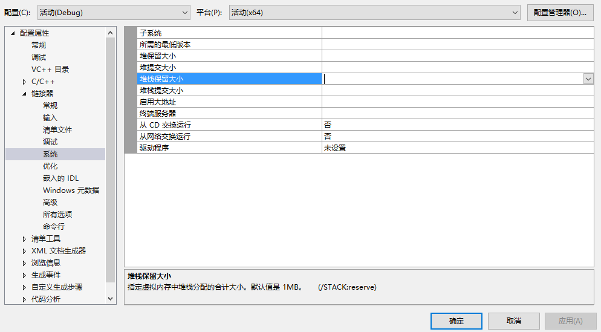

## 内存分布
* C++中内存分为5个区：数据段包含堆、栈、全局/静态区、常量存储区，代码段包含代码区
  * 堆（heap）就是程序员自己分配的内存块，编译器不管释放，由程序员自己释放，如果没释放掉，程序结束后操作系统会自动回收。操作系统有一个记录空闲内存地址的链表，当系统收到程序的申请时，会遍历该链表，寻找第一个空间大于所申请空间的堆结点，然后将该结点从空闲结点链表中删除，并将该结点的空间分配给程序。堆是向高地址扩展的数据结构，是不连续的内存区域，链表遍历方向也是由低地址到高地址，由此可见堆获得的空间比较灵活也比较大，堆的大小受限于计算机系统中有效的虚拟内存（一般最大是4G，试了试VS2017，开辟42919522个int指针触发std::bad_alloc异常，大概163.7MB）。堆一般速度比较慢，而且容易产生内存碎片，不过用起来最方便
  * 栈（stack）就是编译器根据需求自动分配的存储区，通常保存局部变量、函数参数等，程序结束时编译器自动释放。栈是向低地址扩展的数据结构，是一块连续的内存的区域，因此栈顶的地址和栈的最大容量是系统预先规定好的（一般是1MB，试了试char a[1031998]刚好栈溢出）。只要栈的剩余空间大于所申请空间，系统将为程序提供内存，否则将报异常提示栈溢出。栈由系统自动分配，速度较快，但程序员无法控制
  * 全局/静态区存放全局变量和静态变量，已初始化的全局变量和静态变量存储在一块区域（.data），未初始化的存储在另一块区域（.bss），程序结束时系统释放
  * 常量存储区（.rodata）存放常量字符串，程序结束后系统释放
  * 代码区（.text）存放函数体的二进制代码

* VS的堆栈大小可在`链接器 - 系统 - 堆栈保留大小`设置



* 标准库提供了两种智能指针，shared_ptr和unique_ptr，shared_ptr允许多个指针指向同一对象，unique则独占所指对象。标准库还定义了一个weak_ptr伴随类，它是一种弱引用，指向shared_ptr管理的对象。这三种类型定义在memory头文件中
* 默认初始化的智能指针中保存着一个空指针，引用计数为0
```cpp
shared_ptr<int> p;
// 等价于
shared_ptr<int> p(nullptr);
```
* 最安全的分配和使用动态内存的方法是调用make_shared
```cpp
shared_ptr<int> p3 = make_shared<int>(42);
shared_ptr<string> p4 = make_shared<string>(10, '9'); // 9999999999
shared_ptr<int> p5 = make_shared<int>(); // p5指向值初始化的int，即为0
```
* 通常用auto保存make_shared
```cpp
auto p6 = make_shared<vector<string>>();
```
* 每个shared_ptr都有一个关联的计数器称为引用计数。无论何时拷贝一个shared_ptr计数器都会递增，例如用一个shared_ptr初始化另一个，或将它作为参数传递给一个函数以及作为函数返回值。当shared_ptr被赋予新值或被销毁，计数器就会递减，一旦计数器为0，shared_ptr就会自动释放所管理的对象

## 直接管理内存
* 在自由空间分配的内存是无名的，使用new初始化无法为分配的对象命名，而是返回一个指向该对象的指针，默认情况下，动态分配的对象是默认初始化的，即内置类型或组合类型的值未定义，类类型由默认构造函数初始化
```cpp
string* ps = new string; // 空string
int* pi = new int; // pi指向未初始化的int
```
* 直接初始化可以用传统的圆括号初始化，新标准下可以用列表初始化
```cpp
int* pi = new int(1024);
string* ps = new string(10, '9');
vector<int>* pv = new vector<int>{0, 1, 2, 3, 4, 5, 6, 7, 8, 9};
```
* 也可以用值初始化，在类型名后跟一堆空括号即可。对于定义了自己构造函数的类类型，值初始化没有意义，因为不管采用什么形式，对象都会通过默认构造函数来初始化，但对于内置类型则不同，默认初始化的对象的值是未定义的
```cpp
string* ps1 = new string; // 默认初始化为空string
string* ps2 = new string(); // 值初始化为空string
int* pi1 = new int; // 默认初始化，*pi1值未定义
int* pi2 = new int(); // 值初始化为0，*pi2为0
```
* 可以使用auto根据初始化器推断类型，但括号只能有单一初始化器，否则不能使用auto
```cpp
auto p1 = new auto(obj); // 若obj是int则p1是int*
auto p2 = new auto{a, b, c}; // 错误
```
* 用new分配const对象时和其他const一样，要对const初始化，new返回的是指向const的指针
```cpp
const int* pci = new const int(1024);
const string* pcs = new const string;
```
* 内存耗尽时，new不能分配所需求的内存空间，会抛出一个bad_alloc异常，可以使用**定位new**（定义在头文件new中）阻止抛出异常
```cpp
int* p1 = new int; // 分配失败则抛出std::bad_alloc异常
int* p2 = new (nothrow) int; // 分配失败则new返回空指针
```
* delete先销毁指针指向的对象，再释放对应内存，释放非new分配的指针或多次释放相同指针行为是未定义的。可以delete空指针，const对象的值虽然不能被改变，但它本身可被销毁
```cpp
int i, *pi1 = &pi, *pi2 = nullptr;
double pd = new double(33), *pd2 = pd;
delete pi1; // 未定义，pi1指向一个局部变量
delete pi2;
delete pd;
delete pd2; // 未定义，pd2指向的内存已经释放了
// 想要释放一个const动态对象只要delete指向它的指针
const int* pci = new const int(1024);
delete pci;
```
* delete后指针值无效，但很多机器上指针仍保留着地址，这样的指针就变成了空悬指针，可以把nullptr赋予指针使其不是空悬指针。动态内存的一个基本问题就是可能有多个指针指向相同内存，delete后重置指针只对该指针有效
```cpp
int* p(new int(42));
auto q = p;
delete p; // p和q均变为无效
p = nullptr; // 重置p对q没任何作用，q还是空悬指针
```

## shared_ptr和new结合使用
* 可以用new返回的指针初始化智能指针
```cpp
shared_ptr<double> p1; // 等价于shared_ptr<double> p1(nullptr)，引用计数为0
shared_ptr<int> p2(new int(42)); // p2指向一个值为42的int
shared_ptr<int[]> p3(new int[3]{1, 3, 4});
cout << p3[2]; // 4
for(auto x : p3) cout << x; // 错误：p3是指针而不是数组
```
* 接受指针参数的智能指针构造函数是explicit的（阻止隐式转换，explicit函数只能用于直接初始化）
```cpp
shared_ptr<int> p1 = new int(1024); // 错误，内置指针不能转换为智能指针
shared_ptr<int> p2(new int(1024)); // 正确，使用了直接初始化形式
```
* 同理，返回智能指针的函数不能返回普通指针
```cpp
shared_ptr<int> clone(int  p)
{
    return new int(p); // 错误：隐式转换为shared_ptr<int>
    // 必须将shared_ptr显示绑定到一个想要返回的指针上
    // return shared_ptr<int>(new int(p));
}
```
* 多个智能指针指向同一原始数据，会出现多次释放内存的错误
```cpp
int main()
{
	{
		int* i = new int(42);
		shared_ptr<int> p(i);
		shared_ptr<int> q(i);
	} // error
}
```
* 不要用get初始化另一个智能指针或为智能指针赋值，不要delete get返回的指针
```cpp
shared_ptr<int> p(new int(42)); // 引用计数为1
int* q = p.get(); // get返回一个指向智能指针管理对象的内置指针
cout << p.use_count(); // 引用计数仍为1
// 使用q时不要它让管理的指针被释放
{ // 新程序块
// 独立创建的shared_ptr，虽然指向相同内存但二者引用计数都是1
    shared_ptr<int>(q);
} // 程序块结束，q被销毁，它指向的内存被释放
int i = *p; // 未定义，p指向的内存已经被释放了
``` 
* 可以用reset来将一个新的指针赋予一个shared_ptr，reset会更新引用计数，如果需要会释放p指向的对象，常与unique一起使用来控制多个shared_ptr共享的对象
```cpp
shared_ptr<int> p(new int(42));
auto q = p;
cout << p.use_count() << q.use_count(); // 22
p = new int(1024); // 错误
p.reset(new int(1024)); // 正确，p指向一个新对象
cout << p.use_count() << q.use_count(); // 11

if (!p.unique()) // 与p共享对象的智能指针数为1则true，否则false
    p.reset(new string(*p)); // 不是p的唯一用户，分配新的拷贝
*p += newVal; // 现在是唯一用户，可以改变对象的值
```
* 智能指针能确保内存不再需要时将其释放，而直接管理的内存不会
```cpp
void f()
{
    shared_ptr<int> sp(new int(42));
    // 这段代码抛出一个异常且在f中未被捕获
} // 函数结束时shared_ptr自动释放内存，无论是否发生异常
void f()
{
    int *ip = new int(42);
    // 这段代码抛出一个异常且在f中未被捕获
    delete ip;
} // 在new和delete之间发生异常且在f中未捕获则内存不会释放
```
* alias constructor可以使shared_ptr拥有某个对象所有权，但内容指向另一对象，下面是简单的例子
```cpp
// template <class U> shared_ptr(const shared_ptr<U>& x, element_type* p) noexcept;
int main()
{
	auto p = make_shared<int>(1);
	shared_ptr<int> q(p, new int(5)); // q与p共享所有权但内容是5
	cout << *q << endl; // 5
	cout << p.use_count() << q.use_count() << endl; // 22
	p.reset();
	cout << p.use_count() << q.use_count() << endl; // 01
	auto tmp = q.get();
	cout << typeid(tmp).name() << endl; // int*
	// 如果再共享已经reset的p，引用计数也为0，但内容可打印
	shared_ptr<int> r(p, new int(7));
	cout << *r << endl7;
}
```
* 下面是alias constructor对类的例子
```cpp
struct A {
	int i;
	A(int a) : i(a) {}
};
int main()
{
	shared_ptr<A> p = make_shared<A>(A(1));
	shared_ptr<A> q(p, new A(5));
	cout << q->i << endl; // 5
	cout << p.use_count() << q.use_count() << endl; // 22
	p.reset();
	cout << p.use_count() << q.use_count() << endl; // 01
	auto tmp = q.get();
	cout << typeid(tmp).name() << endl; // struct A*
	// 如果再共享已经reset的p，引用计数也为0，但内容可打印
	shared_ptr<A> r(p, new A(7));
	cout << p.use_count() << q.use_count() << r.use_count() << endl; // 010
	cout << r->i << endl; // 7
}
```
## unique_ptr
* 与shared_ptr不同，某个时刻只能有一个unique_ptr指向一个给定对象，当unique_ptr被销毁时，它所指向的对象也被销毁。没有类似make_shared的标准库函数返回一个unique_ptr，当定义一个unique_ptr时，需要将其绑定到一个new返回的指针上，同shared_ptr一样要用直接初始化
```cpp
unique_ptr<int>p(new int(42));
```
* 也可以使用数组直接初始化，但不能用make_unique构造数组（make_unique的参数不能为指针）
```cpp
unique_ptr<int[]> s(new int[3]{1, 3, 4});
unique_ptr<int*> s2(new int[3]{ 1, 3, 4 }); // 错误
cout << s[2]; // 4
auto s3(make_unique<int[]>(new int[3]{1, 3, 4}); // 错误
```
* unique_ptr独占指向的对象，所以不支持普通的拷贝或赋值操作，但可以调用release或reset将指针所有权从一个非const的unique_ptr转移给另一个unique_ptr
```cpp
u.release(); // u放弃控制权，返回指针并将u置空
u.reset(); // 释放u指向的对象
u.reset(q); // 如果提供内置指针q，令u指向这个对象，否则u置空
u.reset(nullptr);

unique_ptr<string> p1(new string("hello");
// 将所有权从p1转给p2
unique_ptr<string> p2(p1.release()); // release返回指针并将p1置空

unique_ptr<string> p3(new string("Trex"));
// 将所有权从p3转给p2
p2.reset(p3.release());
```
* 调用release会切断unique_ptr和它管理对象的联系，release返回一个原始指针，通常用来初始化另一个智能指针或给其赋值，如果没有这样做就要自行负责资源的释放
```cpp
p2.release(); // 错误，p2不会释放内存且丢失了指针
auto p = p2.release(); // 保存了内存，但要记得delete(p)，p是int*
```
* 一个例外是，可以拷贝或赋值一个将要被销毁的unique_ptr，比如函数的返回值
```cpp
// 以下两种情况，编译器知道要返回的对象将要被销毁，此时会进行一种特殊的“拷贝”
unqie_ptr<int> clone(int p)
{
    return unique_ptr<int>(new int(p)); // 或return make_unique<int>(p)
}
// 也可以返回一个局部对象的拷贝
unqie_ptr<int> clone(int p)
{
    unique_ptr<int> ret(new int(p));
    return ret;
}
```
* 注意unique_ptr的构造函数是explict，不能隐式转换，因此必须返回unique_ptr而不能返回原始指针
```cpp
unqie_ptr<int> clone(int p)
{
    return new int(p); // 错误
}
```

## unique_ptr与容器结合的陷阱
* unique_ptr的构造函数是explict，不能隐式转换，在传参时容易忽略这个问题
```cpp
vector<unique_ptr<int>> v;
v.push_back(new int(42)); // 错误：不能将原始指针转为unique_ptr
v.push_back(make_unique<int>(42)); // 正确
```
* 另一个更容易被忽略的问题是传参存在拷贝，而unique_ptr的使用权是唯一的，因此对unique_ptr传参则会出错
```cpp
void f(unique_ptr<int>) {}
auto p = make_unique<int>(42);
f(p); // 错误
```
* 如果把已有的unique_ptr对象添加到容器中，传参时会复制临时量导致出错。正确的做法是使用std::move转移所有权
```cpp
vector<unique_ptr<int>> v;
unique_ptr<int> p(new int(42));
v.push_back(p); // 错误：创建了p的临时量，相当于调用了p.release()
v.push_back(std::move(p)); // 正确
cout << *p; // 错误，p已经失去了控制权
```
* 新特性中可能使此问题更难被发现
```cpp
vector<unique_ptr<int>> v;
v.push_back(make_unique<int>(1));
v.push_back(make_unique<int>(3));
v.push_back(make_unique<int>(2));
std::sort(v.begin(), v.end(), [](auto x, auto y) { return *x > *y; }); // 错误
std::sort(v.begin(), v.end(), [](auto& x, auto& y) { return *x > *y; }); // 正确
for(auto x : v) cout << *x; // 错误
for(auto& x : v) cout << *x; // 正确
```
## weak_ptr
* weak_ptr是一种不控制所指向对象生存期的智能指针，指向一个shared_ptr管理的对象但不改变引用计数，一旦最后一个shared_ptr被销毁，对象就会释放，即使有weak_ptr指向对象。创建一个weak_ptr时需要用shared_ptr初始化
```cpp
auto p = make_shared<int>(42);
weak_ptr<int> wp(p); // wp弱共享p：p的引用计数未改变
```
* 由于对象可能不存在，所以要调用lock检查weak_ptr指向的对象是否存在，lock返回一个shared_ptr智能指针
```cpp
if (shared_ptr<int> np = wp.lock()) // np不为空则条件成立
```
* weak_ptr可以解决循环引用的问题
```cpp
#include <iostream>
#include <memory>

using namespace std;
class B;
class A {
public:
	A() { cout << "A\n"; }
	~A() { cout << "-A\n"; }
	shared_ptr<B> b;
};

class B{
public:
	B() { cout << "B\n"; }
	~B() { cout << "-B\n"; }
	shared_ptr<A> a;
};

int main()
{
	{
		shared_ptr<A> a(new A);
		a->b = shared_ptr<B>(new B);
		a->b->a = a;
	}
	cout << "OK";
	cin.get();
}

// output
A
B
OK
```
* 上例中，退出局部作用域时，a的use_count由2减为1，因此a不会析构，而a中的成员b也不析构，这样就导致了两次内存泄漏，可见使用智能指针不意味着不会内存泄漏。解决方法是把class B中的a成员改为weak_ptr，这样循环引用时不会增加a的use_count，因此结束时a的use_count由1减为0，将正确析构，成员b也将正确析构
```cpp
#include <iostream>
#include <memory>

using namespace std;
class B;
class A {
public:
	A() { cout << "A\n"; }
	~A() { cout << "-A\n"; }
	shared_ptr<B> b;
};

class B{
public:
	B() { cout << "B\n"; }
	~B() { cout << "-B\n"; }
	weak_ptr<A> a;
};

int main()
{
	{
		shared_ptr<A> a(new A);
		a->b = shared_ptr<B>(new B);
		a->b->a = a;
	}
	cout << "OK";
	cin.get();
}

// output
A
B
-A
-B
OK
```

## new和数组
* 动态数组并不是数组类型，分配一个数组会得到一个元素类型的指针而不是一个数组类型的对象，因此不能对动态数组用begin或end，也不能用范围for语句
```cpp
int* pia = new int[get_size()]; // pia指向第一个int
// 也可以用一个表示数组类型的类型别名分配数组
typedef int arrT[42];
int* p = new arrT;
```
* 动态数组是默认初始化的，可以对数组中的元素进行值初始化，只需要在数组大小后跟一对空括号，新标准中还可以用列表初始化。如果初始化数目小于元素数，剩余元素进行值初始化，如果大于元素数，则new表达式失败，不分配内存，抛出一个异常
```cpp
int* pia = new int[10]; // 10个未初始化的int
int* pia = new int[10](); // 10个值初始化为0的int
string* psa = new string[10]; // 10个空string
string* psa = new string[10](); // 10个空string
int* pia3 = new int[10]{0, 1, 2, 3, 4, 5, 6, 7, 8, 9};
string* psa3 = new string[10]{"a", "an", "the", string(3, 'x')};
```
* 可以用任意表达式确定分配对象数目
```cpp
size_t n = get_size();
int* p = new int(n);
for (int* q = p; q != p + n; ++q)
    / *处理数组* /
// 如果n是0，代码仍能正常工作
// 用new分配大小为0的数组，new返回一个合法的非空指针
// 此指针保证与new返回的其他任何指针都不相同
// 相当于一个尾后指针，可用于比较操作，如上面的for循环
char arr[0]; // 错误，不能定义长度为0的数组
char* cp = new char[0]; // 正确，但cp不能解引用
```
* 释放时要加空方括号，它指示编译器此指针指向一个对象数组的第一个元素
```cpp
// 即使用了类型别名而new时未使用方括号，delete也要加[]
typedef int arrT[42];
int* p = new arrT;
delete [] p; // 按逆序销毁数组中的元素，并释放对应内存
```

## allocator类
* new把内存分配和对象构造组合在一起，delete将对象析构和内存释放组合在一起，这样就造成了灵活性上的局限，通常我们在分配单个对象时希望将内存分配和对象初始化组合在一起，这样我们可以肯定知道对象应该有什么值
```cpp
// 把内存分配和对象构造组合在一起可能导致浪费
string* const p = new string[n]; // 构造n个空string
string s;
string* q = p;
while (cin >> s && q != p + n)
    *q++ = s;
const size_t size = q - p; // 记住读取了多少个string
delete [] p;
// 我们可能不需要n个string，于是就创建了一些永远用不到的对象
// 对于要使用的对象，又在默认初始化之后立即赋新值
// 于是每个用到的元素都被先后被赋值了两次
// 更重要的是，没有构造函数的类不能动态分配数组
```
* allocator类定义在memory中，它把内存分配和对象构造分离开来。它提供一种类型感知的内存分配方法，分配的内存是原始未构造的
```cpp
allocator<T> a;
a.allocate(n); // 分配一段未构造的内存保存n个T类型对象
a.deallocate(p ,n); // 释放T*指针p开始保存了n个T类型对象的内存
// p必须是一个由allocate返回的指针，n必须是p创建时所要求的大小
// 调用deallocate之前必须对每个这块内存中创建的对象调用destroy
a.construct(p, args); // p必须是T*类型指针，指向一块原始内存
// args被传递给T类型构造函数，在p指向的内存中构造一个对象
a.destroy(p); // p为T*类型指针，对p指向的对象执行析构函数
```
* 为了使用allocate返回的内存，用construct构造对象，construct在给定位置构造一个元素，额外参数用来初始化构造对象
```cpp
allocator<string> alloc;
auto const p = alloc.allocate(n); // 分配内存给n个未初始化的string
auto q = p; // q指向最后构造的元素之后的位置
alloc.construct(q++); // *p为空字符串
alloc.construct(q++, 10, 'c'); // *p为cccccccccc
alloc.construct(q++, "hi"); // *p为hi
```
* 用完对象后，必须对每个构造的元素调用destroy销毁，destroy接受一个指针，调用指向对象的析构函数，只能对真正构造了的对象destroy，对于没有析构函数的类型（如int等内置类型）destroy不起作用
```cpp
while (q != p)
    alloc.destroy(--q); // q指向最后构造的元素之后的位置，因此要先自减
```
* 元素销毁后，可以使用这部分内存保存其他string，也可以调用deallocate还给系统，传递给它的指针必须指向由allocate分配的内存，且传递的大小参数必须与allocate分配内存时提供的大小相同
```cpp
alloc.deallocate(p, n);
```
* 标准库为allocator类定义了两个伴随算法，可以在未初始化内存中创建对象
```cpp
uninitialized_copy(b, e, b2); // 把b到e范围的元素拷贝到b2指定的未构造的原始内存
// b2指向的内存必须够大，能容纳输入序列中元素的拷贝
unitialized_copy_n(b, n, b2); // 从b开始，拷贝n个元素到b2
unitialized_fill(b, e, t); // 在b到e范围内创建值均为t的拷贝
unitialized_fill_n(b, n, t); // 从b开始的内存地址，创建n个值t
// b必须指向能容纳给定数量对象的原始内存

// 把一个vector<int>拷贝到大一倍空间的动态内存，并对剩余空间填充定值
auto p = alloc.allocate(vi.size() * 2); // vi是一个vector<int>
auto q = unitialized_copy(vi.begin(), vi.end(), p);
unitialized_fill_n(q, vi.size(), 42);
```
## vector扩容重新分配内存的过程
* [allocate](https://en.cppreference.com/w/cpp/memory/allocator/allocate)：分配未构造的新内存块（大小一般是原来的1.5倍或2倍）
```cpp
allocator<T> newAllocator;
auto p = newAllocator.allocate(v.size() * 2);
```
* [construct](https://en.cppreference.com/w/cpp/memory/allocator/construct)：把元素从容器的旧内存拷贝到新内存
```cpp
auto q = p;
for(int i = 0; i < v.size(); ++i)
{
    newAllocator.construct(q++, v[i]);
}
```
* [destroy](https://en.cppreference.com/w/cpp/memory/allocator/destroy)：调用~T()析构旧内存中的对象
```cpp
// p2指向oriAllocator首位置，q2指向尾后位置
while(q2 != p2) oriAllocator.destroy(--q2);
```
* [deallocate](https://en.cppreference.com/w/cpp/memory/allocator/deallocate)：释放旧内存
```cpp
oriAllocator.deallocate(p2, v.size());
```
