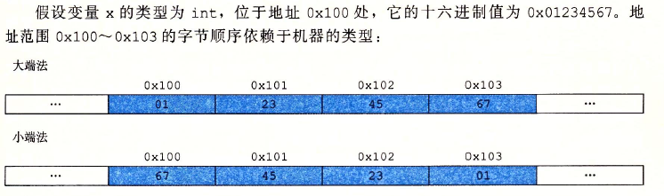

> ## tuple类型
```cpp
tuple<T1, T2, ..., Tn> t;
tuple<T1, T2, T3, ..., Tn> t(v1, v2, ..., vn); // 此构造函数为explicit
t1 == t2;
t1 != t2;
t1 relop t2; // 关系运算符使用字典序，两个tuple具有相同数量成员
get<i>(t); // 返回t的第i个成员的引用，t是左/右值则返回左/右值
tuple_size<tupleType>::value; // 通过tuple初始化类模板
// public constexpr static成员value类型为size_t，代表成员数
tuple_element<i, tupleType>::type; // 类模板通过int和tuple类型初始化
// public成员type表示tuple类型中指定成员的类型
```
* 定义tuple需要指出每个成员类型
```cpp
tuple<size_t, size_t, size_t> threeD; // 三个成员设置为0
tuple<string, vector<double>, int, list<int>>
    someVal("contains", {3.14, 2.78}, 42, {0, 1, 2, 3, 4});
```
* 创建tuple对象可以使用tuple的默认构造函数，它是explicit，所以要直接初始化
```cpp
tuple<size_t, size_t, size_t> threeD = {1, 2, 3}; // 错误
tuple<size_t, size_t, size_t> threeD{1, 2, 3}; // 正确
```
* 可以用make_tuple生成tuple对象
```cpp
auto item = make_tuple("0-999-78343-X", 3, 20.00);
// make_tuple用初始值推断tuple类型
// item的类型为tuple<const char*, int, double>
```
* 用get访问成员，传递给get一个tuple对象，返回指定成员的引用
```cpp
auto book = get<0>(item);
auto cnt = get<1>(item);
auto price = get<2>(item) / cnt;
get<2>(item) *= 0.8;
```
* 用辅助类模板tuple_size和tuple_element查询tuple成员的数量和类型
```cpp
typedef decltype(item) trans; // trans是item的类型
size_t sz = tuple_size<trans>::value; // 成员数量
tuple_element<1, trans>::type cnt = get<1>(item); // cnt类型为item第二个成员类型
```
* 两个tuple成员数量相等才能比较，tuple定义了<和==，对每对成员使用<或==都必须合法
```cpp
tuple<string, string> duo("1", "2");
tuple<size_t, size_t> twoD(1, 2);
bool b = (duo == two D); // 错误：不能比较size_t和string
tuple<size_t, size_t, size_t> threeD(1, 2, 3); //
b = (twoD < threeD); // 错误：成员数量不同
tuple<size_t, size_t> orgin(0, 0);
b = (origin < twoD); // 正确
```
* tuple常用于给函数返回多个值
```cpp
// files中每个元素保存一家书店的销售记录
vector<vector<sales_data>>files;
// 对一本给定的书在files中搜索出售过此书的店
// 对每家店创建一个tuple保存指出书店在files中位置的索引和两个迭代器
typedef tuple<vector<sales_data>::size_type,
    vector<sales_data>::const_iterator,
    vector<sales_data>::const_iterator> matches;
vector<matches>
findBook(const vector<vector<sales_data>>& files, const string& book)
{
    vector<matches> ret;
    for (auto it = files.cbegin(); it != files.end(); ++it)
    {
        // 查找有相同ISBN的sales_data范围
        auto found = equal_range(it->cbegin(), it->cend(), book, compareIsbn);
        // equal_range返回一个迭代器pair表示元素范围，未找到book则两个迭代器相等为空范围
        if (found.first != found.second) // 此书店销售了给定书籍
            // 记住此书店的索引及匹配的范围
            ret.push_back(make_tuple(it - files.cbegin(), found.first, found.second);
    }
    return ret; // 未找到匹配记录则为空
}
// 使用返回的tuple
void reportResults(istream& in, ostream& os, const vector<vector<sales_data>>& files)
{
    string s;
    while (in >> s)
    {
        auto trans = findBook(files, s);
        if (trans.empty())
        {
            cout << s << " not found in any stores" << endl;
            continue; // 获得下一本要查找的书
        }
        for (const auto& store : trans)
            os << "store " << get<0>(store) << " sales: "
                << accumulate(get<1>(store), get<2>(store), sales_data(s))
                << endl;
    }
}
```

> ## [正则表达式](https://www.cnblogs.com/Akeke/p/6649589.html)
* C++11中引入了正则表达式库，包含在[\<regex\>](http://www.cplusplus.com/reference/regex/)中，使用的是[ECMAScript语法](http://www.cplusplus.com/reference/regex/ECMAScript/)
```cpp
regex // 正则表达式的类
regex_match // 将一个字符序列和正则表达式匹配，返回一个bool
regex_search // 寻找第一个与正则表达式匹配的子序列，返回一个bool
regex_replace // 使用给定格式替换一个正则表达式
sregex_iterator // 迭代器适配器，调用regex_search遍历string中所有匹配的子串
smatch // 容器类，保存在string中搜索的结果
ssub_match // string中匹配的子表达式的结果
```
* [regex_match](http://www.cplusplus.com/reference/regex/regex_match/)和[regex_search](http://www.cplusplus.com/reference/regex/regex_search/)的参数
```cpp
// 在字符序列seq中查找regex对象r中的正则表达式
// m是一个match对象，用来保存匹配结果
// mft是一个可选的regex_constants::match_flag_type值
(seq, m, r, mft)
(seq, r, mft)
```
* 查找不符合规则“i除非在c之后，否则必须在e之前”的单词
```cpp
// 查找不在字符c之后的字符串ei
string pattern("[^c]ei"); // [^c]表示任意不是c的字符
// [[:alpha:]]匹配任意字母，后接*代表任意数量的字母
pattern = "[[:alpha:]]*" + pattern + "[[:alpha:]]*";
regex r(pattern);
smatch results;
string test_str = "receipt freind thief receive";
if (regex_search(test_str, results, r))
    cout << results.str() << endl; // freind
```
* [regex](http://www.cplusplus.com/reference/regex/basic_regex/)选项
```cpp
regex r(re);
regex(re, f);
// re可以是一个string，一对迭代器，一个以空字符结尾的字符数组的指针
// 或是一个字符指针，一个计数器，一个花括号包围的字符列表
// f是指出对象如何处理的标志，默认值为ECMAScript
r1 = re; // 将r1中的正则表达式替换为re，re可以是上述类型或regex类型
r1.assign(re, f);
r.mark_count(); // r中子表达式的数目
r.flags(); // 返回r的标志集

// f可选的标志
icase // 匹配过程忽略大小写
nosubs // 不保存匹配的子表达式
optimize // 执行速度优于构造速度
// 下列都是指定对应的正则表达式语法
ECMAScript
basic
extended
awk
grep
egrep
```
* 匹配一个或多个字母或数字后接三个扩展名之一
```cpp
// 因为.代表匹配任意字符，所以要加\转义
// 又因为\本身需要转义，所以是\\.
regex r("[[:alnum:]]+\\.(cpp|cxx|cc)$", regex::icase); // 注意加号前后不要加空格
smatch results;
string filename;
while(cin >> filename)
    if (regex_search(filename, results, r))
        cout << results.str() << endl;
```
* 使用RE库类型必须与输入序列类型匹配
```cpp
if (regex_search("myfile.cc", results, r)) // 错误：输入为char*不匹配results类型
```
* 如果希望搜索字符数组，应该用cmatch对象。各种输入类型对应的RE库组件类型如下

|输入序列类型|使用的正则表达式类|
|:-:|:-:|
|string|regex、smatch 、ssub_match、sregex_iterator|
|const char*|regex、cmatch 、csub_match、cregex_iterator|
|wstring|wregex、wsmatch 、wssub_match、wsregex_iterator|
|const wchar_t*|wregex、wcmatch 、wcsub_match、wcregex_iterator|

* sregex_iterator操作（同样适用于cregex_iterator、wsregex_iterator、wcregex_iterator）
```cpp
sregex_iterator it(b, e, r);
sregex_iterator end; // 尾后迭代器
*it
it->
++it
it++
it1 == it2
it1 != it2
```
* 上述第一个例子只打印第一个匹配的单词，可以用sregex_iterator遍历所有匹配结果
```cpp
// 查找不在字符c之后的字符串ei
string pattern("[^c]ei"); // [^c]表示任意不是c的字符
// [[:alpha:]]匹配任意字母，后接*代表任意数量的字母
pattern = "[[:alpha:]]*" + pattern + "[[:alpha:]]*";
regex r(pattern, regex::icase);
smatch results;
for (sregex_iterator it(file.begin(), file.end(), r), end_it;
    it != end_it; ++it)
    cout << it->str() << endl;
```
* 如果希望再打印出匹配结果的上下文
```cpp
for (sregex_iterator it(file.begin(), file.end(), r), end_it;
    it != end_it; ++it)
{
    cout << it->str() << endl;
    auto pos = it->prefix().length(); // 前缀大小
    pos = pos > 40 ? pos - 40 : 0;
    cout << it->prefix().str().substr()(pos) // 前缀序列
        << "\n\t\t>>> " << it->str() << " <<<\n" // 突出这个单词
        << it->suffix().str().substr(0, 40) // 后缀序列
        << endl;
}
```
* smatch操作（适用于其他同类）
```cpp
m.ready() // 检查是否设置通过regex_match或regex_search设置m
m.size()
m.empty()
m.prefix() // 一个ssub_match对象，表示当前匹配前的序列
m.suffix() // 一个ssub_match对象，表示当前匹配后的序列
m.length(n) // 第n个匹配的子表达式的大小
m.position(n) // 第n个字表达式距序列开始的距离
m.str(n) // 第n个子表达式匹配的string
m[n] // 对应第n个子表达式的ssub_match对象
m.begin(), m.end()
m.cbegin(), m.cend()
```
* 使用子表达式来匹配结果，如[[:alnum:]]+\\.(cpp|cxx|cc)可分为两个子表达式`([[:alnum:]]+)`和`(cpp|cxx|cc)`，现在只想匹配第一个子表达式
```cpp
regex r("[[:alnum:]]+\\.(cpp|cxx|cc)$", regex::icase);
smatch results;
string filename;
while(cin >> filename)
    if (regex_search(filename, results, r))
        cout << results.str(1) << endl; // 打印第一个子表达式
```
* 如文件名为foo.cpp，results.str(0)将保存foo.cpp，results.str(1)保存foo，results.str(2)保存cpp
* 子表达式的一个常见用途就是验证匹配特定格式数据，比如美国电话号有十位数字，包含一个区号和七位的本地号码，区号可以放在括号里，剩余七位数字可以用一个短横线、一个点或是一个空格分隔，也可以不用。在编写电话号码模式前先了解ECMAScript正则表达式语言的一些特性
  * \{d}表示单个数字，\{d}{n}表示n个数字的序列，如\{d}{3}匹配3个数字的序列
  * 方括号中的字符集合表示匹配这些字符中任意一个，如[-. ]匹配一个短横线或点或空格，点在括号中没有特殊含义
  * 后接?表示可选的，如\{d}{3}[-. ]?{d}{4}匹配开始是3个数字，后接一个可选的短横线或点或空格，然后是4个数字
  * \表示转义，因为括号属于ECMAScript特殊字符，所以要用\(和\)来表示
  * 因为\是C++特殊字符，所以在模式中每次出现\都要写成\\
* 最终可以得到电话模式如下，为了获得匹配的部分，需要在定义正则表达式时使用子表达式，每个子表达式用一对括号包围
```cpp
(\\()?(\\d{3})(\\))?([-. ])?(\\d{3})([-. ])?(\\d{4})
```
* 使用
```cpp
string phone =
    "(\\()?(\\d{3})(\\))?([-. ])?(\\d{3})([-. ])?(\\d{4})";
regex r(phone);
smatch m;
string s;
while (getline(cin, s)) {
    for (sregex_iterator it(s.begin(), s.end() r), end_it;
        it != end_it; ++it)
    if (valid(*it)) // 检查是否合法
        cout << "valid: " << it->str() << endl;
    else
        cout << "not valid: " << it->str() << endl;
}

// valid函数如下
bool valid(const smatch& m)
{
    // 如果区号前有一个左括号
    if (m[1].matched)
        // 则区号后必有一个右括号，之后紧跟剩余号码或一个空格
        return m[3].matched
            && (m[4].matched == 0 || m[4].str() == " ");
    else
        // 否则不能有右括号
        // 另两个组成部分间的分隔符必须匹配
        return !m[3].matched
            && m[4].str() == m[6].str();
}
```
* 如果希望将匹配序列转换为另一个序列，如希望将美国电话号码转换为ddd.ddd.dddd，即区号和后面三位数字用点分隔，此时需要使用[regex_replace](http://www.cplusplus.com/reference/regex/regex_replace/)
```cpp
// 使用格式化字符串fmt生成格式化输出匹配在m中
// 可选的match_flag_type标志在mft中
m.format(dest, fmt, mft)
m.format(fmt, mft)
// 遍历seq，用regex_search查找与regex对象r匹配的子串
// 第一个版本将输出写到迭代器dest指定的位置
// 第二个版本返回一个string保存输出
// fmt可以是string或字符数组的指针
// mft默认为match_default
regex_replace(dest, seq, r, fmt, mft)
regex_replace(seq, r, fmt, mft)
```
* 替换字符串由想要的字符组合与匹配的子表达式组成，本例中希望在替换字符串中使用第二个第五个和第七个子表达式，用$后接子表达式的索引号来表达特定的表达式
```cpp
string fmt = "$2.$5.$7"; // 将号码格式改为ddd.ddd.dddd
regex r(phone);
string number = "(908) 555-1800";
cout << regex_replace(number, r, fmt) << endl; // 908.555.1800
```
* 正则表达式还可以用于替换大文件，比如一个文件中每行是一个人名和电话号码，要把所有电话号码按上述格式替换
```cpp
int main()
{
    string phone
        = "(\\()?(\\d{3})(\\))?([-. ])?(\\d{3})([-. ])?(\\d{4})";
    regex r(phone);
    smatch m;
    string s;
    string fmt = "$2.$5.$7"; // 将号码格式改为ddd.ddd.dddd
    while (getline(cin, s))
        cout << regex_replace(s, r, fmt) << endl;
    return 0;
}
```
* regex_replace默认输出整个输入序列，不匹配部分会原样输出，匹配部分会按指定格式输出。如果希望只输出改格式后的电话号码而不包含人名，可以通过设定format_no_copy来改变默认行为
```cpp
string fmt2 = "$2.$5.$7 "; // 最后放个空格作为分隔符
cout << regex_replace(s, r, fmt2, format_no_copy) << endl;
```
* 格式化标志可以传递给regex_search、regex_match或是类smatch的format成员，标志类型为match_flag_type，定义在命名空间regex_constants中，使用前必须指定命名空间
```cpp
using std::regex_constants::format_no_copy;
using namespace std::regex_constants;
```
* 所有标志
```cpp
// 定义在regex_constants::match_flag_type中
match_default 等价于format_default
match_not_bol 不将首字符作为行首处理
match_not_eol 不将尾字符作为行尾处理
match_not_bow 不将首字符作为单词首处理
match_not_eow  不将尾字符作为单词尾处理
match_any 如果存在多余一个匹配，则可返回任意一个
match_not_null 不匹配任何空序列
match_continuous 匹配必须从输入的首字符开始
match_prev_avail 输入序列包含第一个匹配之前的内容
format_default 用ECMAScript规则替换字符串
format_sed 用POSIX sed规则替换字符串
format_no_copy 不输出输入序列中未匹配的部分
format_first_only 只替换子表达式的第一次出现
```

> ## typeid运算符
* 通常使用typeid比较两条表达式的类型是否相同
```cpp
D* d = new D;
B* b = d;
// 运行时比较类型
if (typeid(*b) == typeid(*d))
{ ... }
// 检查运行时类型是否为指定类型
if (typeid(*b) == typeid(D)) // typeid作用于对象，不能写typeid(b)
{ ... }
```
* type_info类定义在typeinfo头文件中，name成员返回C风格字符串，表示对象的类型名
```cpp
#include <iostream>
#include <typeinfo>
#incdlue <vector>
class B{};
class D : public B{};
int main()
{
    int a[10];
    vector<double> v;
    D d;
    B* p = &d;
    std::cout << typeid(42).name() << "\n"
        << typeid(a).name() << "\n"
        << typeid(v).name() << "\n"
        << typeid(std::string).name() << "\n"
        << typeid(p).name() << "\n"
        << typeid(*p).name();
}
// 打印结果如下
int
int [10]
class std::vector<double,class std::allocator<double> >
class std::basic_string<char,struct std::char_traits<char>,class std::allocator<char> >
class B *
class B
```

> ## 枚举类型
* 枚举属于字面值常量类型，C++11引入了限定作用域的枚举类型，关键字为enum class或enum struct，因此也可以简称为枚举类
```cpp
enum class open_modes {input, output, append};
```
* 定义不限定作用域的枚举类型省略关键字class，不限作用域的枚举成员名称不能重复
```cpp
enum color { red, yellow, green };
enum color2 { green }; // 错误：重定义green
auto green = bool; // 错误，但有些编译器可能允许
// 未命名的，不限定作用域的枚举类型
enum {floatPrec = 6, doublePrec = 10, double_doublePrec = 10};
```
* enum class中，成员在枚举类型的作用域外不可访问。在enum中，成员作用域与枚举类型本身的作用域相同
```cpp
enum color {red, yellow, green};
enum class pappers {red, yellow, green}; // 正确：枚举成员被隐藏
color eyes = green; // 正确：有效作用域
pappers p = green; // 错误：这是color::green而非pappers::green
color hair = color::red; // 正确
pappers p2 = pappers::red; // 正确
```
* 默认情况枚举从0开始依次加1，也可以指定值，枚举成员是const，初始化枚举成员的初始值必须是常量表达式。如果没有提供初始值，当前枚举成员值等于前一个成员值加1
```cpp
enum class intTypes {
    charTyp = 8, shortTyp = 16, intTyp = 16,
    longTyp = 32, long_longTyp = 64
};
// 可以定义枚举类型的constexpr变量
constexpr intTypes charbits = intTypes::charTyp;
```
* enum对象或枚举成员会自动隐式转换为整型，而enum class不会
```cpp
int i = color::red; // 正确
int j = pappers::red; // 错误：限定作用域的枚举类型不会进行隐式转换
```
* C++11中可以在enum后加冒号以及要在enum中使用的类型，如果不指定，默认限定作用域的enum为int，不限定作用域的枚举类型则不存在默认类型
```cpp
enum intValues : unsigned long long {
    charTyp = 255, shortTyp = 65535, intTyp = 65535,
    longTyp = 4294967295UL,
    long_longTyp = 18446744073709551615ULL
}
```
* C++11中可以提前声明enum
```cpp
enum intValues : unsigned long long; // enum必须指定成员类型
enum class open_modes; // enum class默认int
```
* 必须使用enum类型的另一个对象或成员来初始化对应的enum对象，即使int值与枚举成员值相等，也不能作为函数的enum实参使用
```cpp
enum color {red = 2, blue = 1};
void f(color);

color e = red;
f(red); // f(color)
f(e); // f(color)
f(2); // 错误
```
* 但可以将enum对象或成员传给整型形参，此时enum值提升成int或更大的整型，提升结果由枚举类型的潜在类型决定
```cpp
enum color {red, blue};
void f(unsigned char);
void f(int);

unsigned char uc = red;
f(red); // f(int)
f(uc); // f(unsigned char)
```

> ## union：一种节省空间的类
* union是一种特殊的类，一个union可以有多个数据成员，但任意时刻只有一个数据成员可以有值。给union的某个成员赋值后，其他成员就变成未定义状态，如果使用错误的数据成员或为错误的数据成员赋值程序可能崩溃
* 分配给union的空间至少要容纳最大的数据成员
* union不能含有引用
* C++11中含有构造函数或析构函数的类类型可以作为union成员
* union可以为成员指定public、protected和private等保护标记，默认情况下所有成员为public
* union可以方便地表示一组类型不同的互斥值
```cpp
union Token {
    char cval;
    int ival;
    double dval;
};
Token first_token = {'a'}; // 初始化cval成员
Token last_token;
last_token.cval = 'z';
Token* pt = new Token;
pt->ival = 42;
```
* 匿名union是一个未命名的union，一旦定义匿名union编译器就会自动创建一个未命名对象。匿名union不能包含protected或private成员，也不能定义成员函数
```cpp
union {
    char cval;
    int ival;
    double dval;
}; // 定义一个未命名对象，可以直接访问成员
cval = 'c';
ival = 42; 
```
* 机器的存储规则中，低位在前的方式称为小端法，高位在前的方式称为大端法



* 判断大小端的代码如下
```cpp
#include <iostream>  
using namespace std;
// 直接判断int低位是否存值
bool f1() {
    int x = 1;
    if (*(char*)&x == 1) return true;
    else return false;
}
// 通过union判断低位int值  
bool f2() {
    union u
    {
        int i;
        char c;
    }t;
    t.i = 1;
    return (t.c == 1);
}
int main() {
    if (f1()) cout << "小端" << endl;
    else cout << "大端" << endl;
    if (f2()) cout << "小端" << endl;
    else cout << "大端" << endl;
}
```
* 将一个double数转换成64位的IEEE-754标准的数
```cpp
#include <iostream>
#include <iomanip>
#include <cstdint>
using namespace std;
union tmp
{
    double x;
    uint64_t u;
};
ostream& operator<<(ostream& os, tmp& t)
{
    os << hex << t.u;
    return os;
}
int main()
{
    tmp t;
    double d = -0.15625;
    t.x = d;
    cout << t; // 打印bfc4000000000000
}
```

> ## 位域
* 位域在内存中的布局是机器相关的
* 位域的类型必须是整型或枚举类型，通常用无符号类型保存位域
```cpp
typedef unsigned int Bit;
class File {
    Bit mode: 2; // mode占2个二进制位
    Bit modified: 1; // modified占1个二进制位
    Bit prot_owener: 3;
    Bit prot_group: 3;
    Bit prot_world: 3;
public:
    // 文件类型以八进制表示
    enum modes { READ = 01, WRITE = 02, EXECUTE = 03 };
    File& open(modes);
    void close();
    void write();
    bool isRead() const;
    void setWrite();
}
```
* mode位域占2个二进制位，modified占1个，其他成员各占3个，如果可能，在类的内部连续定义的位域压缩在同一整数的相邻位从而提供存储压缩
* 取址符不能用于位域，因此任何指针都无法指向类的位域
* 访问位域和访问类的其他成员相似
```cpp
void File::write() {
    modified = 1;
    ...
}
void File::close() {
    if (modified)
    ...
}
```
* 通常使用内置的位运算符操作超过1位的位域
```cpp
File& File::open(File::modes m)
{
    mode |= READ;
    ...
    if (m & WRITE)
    ...
    return *this;
}
```
* 如果一个类定义了位域成员，通常也会定义一组内联成员函数检验或设置位域值
```cpp
inline bool File::isRead() const { return mode & READ; }
inline void File::setWrite() { mode |= WRITE; }
```

> ## volatile限定符
* 当对象的值可能在程序的控制或检测之外被改变，声明为volatile，告诉编译器不对该对象进行优化
```cpp
// volatile用法和const相似
volatile int i; // 该int值可能发生改变
volatile Task* curr_task; // curr_task指向volatile对象
volatile int a[max]; // a的每个元素都是volatile
volatile A a; // a的每个成员都是volatile
```
* const和volatile互不影响，某种类型可能同时是const和volatile，就像类可以定义const成员函数一样，也可以定义volatile成员函数，只有volatile成员函数才能被volatile对象调用
* volatile和指针的关系与const用法类似，只能将volatile对象的地址赋给指向volatile的指针，同时只有当某个引用是volatile时才能用volatile对象初始化该引用
```cpp
volatile int v1;
int* volatile v2;
volatile int* v3;
volatile int* volatile v4;
int* p = &v1; // 错误：必须指向volatile的指针
v3 = &v1; // 正确
v4 = &v1; // 正确
```
* const和volatile的一个重要去呗是不能用合成的拷贝/移动构造函数和赋值运算符初始化volatile对象，合成的成员接受的形参类型是非volatile的const引用，显然不能把一个非volatile引用绑定到volatile对象上
* 如果一个类要拷贝、移动或赋值volatile对象，必须自定义操作，例如将形参类型指定为const volatile引用就能用任意类型A进行拷贝或赋值操作
```cpp
class A {
public:
    A(const volatile A&); // 从volatile对象进行拷贝
    // 将一个volatile对象赋值给一个非volatile对象
    A& operator=(volatile const A&);
    // 将一个volatile对象赋值给一个volatile对象
    A& operator=(volatile const A&) volatile;
    ...
};
```
